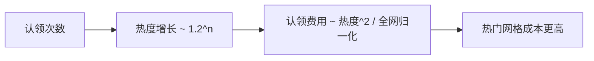
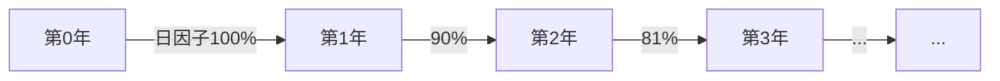
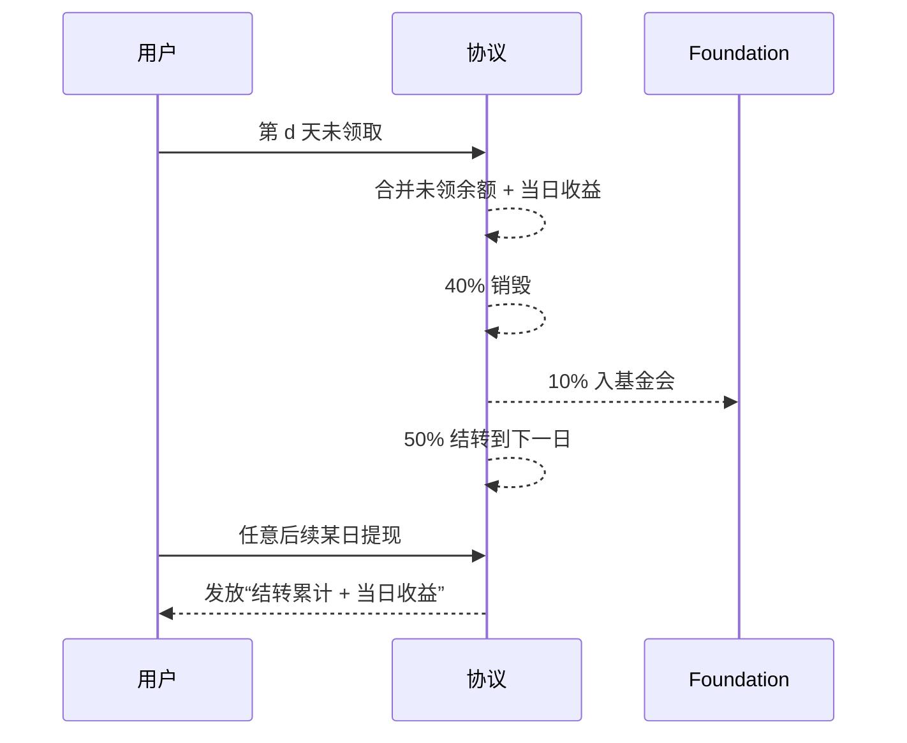
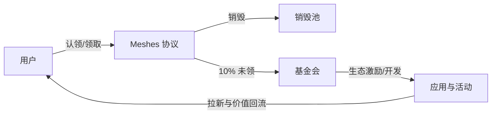

# Parallels Meshes 白皮书（用户友好版）

## 一、项目愿景
Parallels Meshes 让地球表面的每一块小网格都成为可被“开采”和“赋能”的数字资产。任何人都可以认领网格并参与每日收益分配；收益会随着时间逐年递减，未领取的部分按规则自动处理，形成“用则得、弃则散”的健康循环。

## 二、三条核心规则（通俗版）
- 网格怎么来？
  - 地球被划分成约 1 平方公里的小方格。每个网格用经纬度两位小数编码：形如 `E12147N3123`，代表东经 121.47、北纬 31.23。
- 如何认领？
  - 每个用户对同一网格只可认领一次，但可以认领无限多个不同网格；同一网格可被无限多用户认领。
  - 网格越热门（认领次数越多），再次认领所需的代币费用越高（指数增长）。
- 如何拿收益？
  - 每天可领取当天收益；如果当天没领，系统会在每天结束时自动把“未领取的累计金额”衰减 50%（40%销毁、10%进入基金会），剩余 50%保留到下一次领取时一并拿走。

## 三、挖矿难度与收益预期（图示）
- 热度与费用随认领次数指数增长：

- 每日收益逐年递减（长期通胀可控）：

- 未领收益“日衰减 50%”，避免囤积：

- 示例（便于感知，不代表真实参数）：

| 天数 | 当日应得 | 是否领取 | 日终销毁40% | 基金会10% | 结转50% | 次日累计未领 |
|---|---:|:---:|---:|---:|---:|---:|
| d0 | 100 | 否 | 40 | 10 | 50 | 50 |
| d1 | 100 | 否 | 80 | 20 | 100 | 150 |
| d2 | 100 | 是 | 0 | 0 | 0 | 0（领取 150+100） |

## 四、参与者与价值流动
- 普通参与者：认领网格、每日领取、参与活动（打卡、寻宝、社区任务等）。
- 基金会：获得未领取金额的 10% 用于生态发展、内容激励、技术维护等；公开透明、由多签治理。
- 市场与应用方：围绕网格开发玩法与应用（地理任务、线下活动、第三方小游戏等）。

## 五、核心优势
- 易懂：三条规则即可理解核心玩法。
- 公平：早期受益、热门昂贵、冷门易入，鼓励探索新区域。
- 可持续：每日收益逐年递减；未领自动“蒸发一半”，避免无限堆积。
- 安全与治理：多签、可暂停、重入保护；前端预换，降低合约外部依赖风险。

## 六、公式与算法（附录）
- 时间索引：
  - 日：\( d=\left\lfloor\dfrac{t-genesisTs}{86400}\right\rfloor \)
  - 年：\( y=\left\lfloor\dfrac{t-genesisTs}{365\times86400}\right\rfloor \)
- 网格 ID（与前端一致）：
  - 规则：`^[EW][0-9]+[NS][0-9]+$`；数字为两位小数乘以 100 的整数（经度 0–17999，纬度 0–9000）。
- 热度与认领费用：
  - \( Heat(n)=\min\!\big(H_0\cdot b^{n},\ H_{\\max}^{cap}\big) \)，\( H_0=1.0,\ b=1.2 \)
  - \( Cost_n=\left\lfloor K\cdot\dfrac{Heat(n)^2}{\max(H_{\\max},1)}\right\rfloor \)
  - 用户累计权重：\( W_u \leftarrow W_u + Heat(n) \)
- 日度发放（逐年 10% 衰减、无总量上限）：
  - \( F_0=10^{10} \)，\( F(d)=F_0\cdot(0.9)^{y(d)} \)
  - \( R_d=\left\lfloor\dfrac{F(d)\cdot W_u}{10^{10}}\right\rfloor \)
- 每日自动处理（未领“日衰减 50%”）：
  - 若未领取：合并 \( X_d=B_d+R_d \)，则
    - \( B_{d+1}=\left\lfloor \dfrac{X_d}{2} \right\rfloor \)
    - \( Burn_d=\left\lfloor 0.4\cdot X_d \right\rfloor \)
    - \( Fund_d=\left\lfloor 0.1\cdot X_d \right\rfloor \)
  - 若已领取：\( Payout_d=B_d+R_d,\ B_{d+1}=0 \)

## 七、生态发展展望
- 早期：热点网格带动传播；认领成本较低，日活强；打卡、寻宝等活动助推冷门区域参与。
- 中期：每日收益按年递减，通胀压力下降；生态资金稳定（未领 10% 基金会），可反哺应用与社区建设。
- 晚期：常规发放趋缓，重心转向代币使用价值与生态玩法（治理、UGC、线下联动、小游戏等）。

## 八、合规与透明
- 协议参数、基金会支出、销毁数据等均将公开透明；关键参数由多签治理，变更前公示。

——
本文为用户友好版白皮书。技术细节与参数请参考 `RULES.md` 与合约代码。我们将与社区共创生态玩法与应用，让每一块网格都拥有独特的价值与故事。
